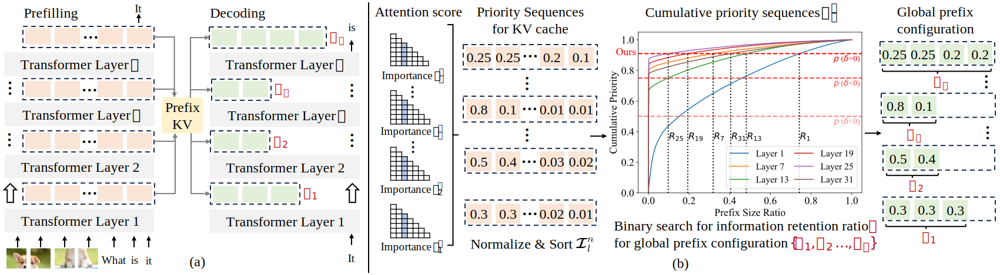
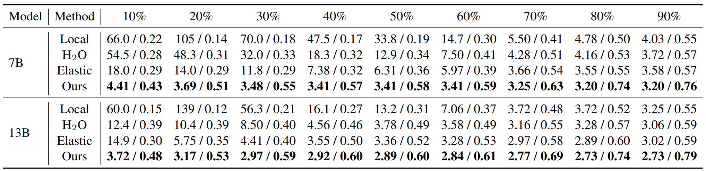
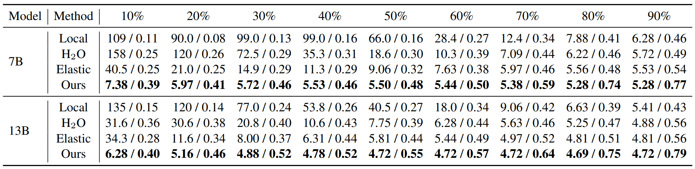
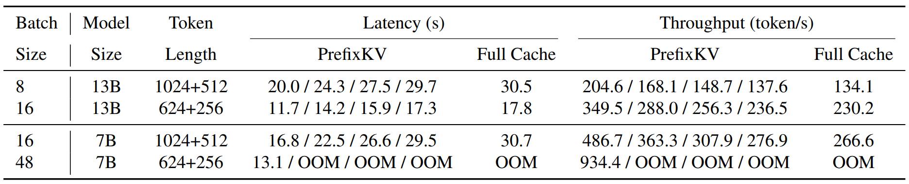

# [PrefixKV: Adaptive Prefix KV Cache is What Vision Instruction-Following Models Need for Efficient Generation](https://arxiv.org/abs/2412.03409)

Official PyTorch implementation of **PrefixKV**.

[PrefixKV: Adaptive Prefix KV Cache is What Vision Instruction-Following Models Need for Efficient Generation](https://arxiv.org/abs/2412.03409).\
Ao Wang, Hui Chen, Jianchao Tan, Kefeng Zhang, Xunliang Cai, Zijia Lin, Jungong Han, Guiguang Ding\
[[`arXiv`](https://arxiv.org/abs/2412.03409)]

---

<p align="center">

</p>

We propose **PrefixKV**, a new KV cache compression method for efficient and accurate generation of large vision-language models.

<details>
  <summary>
  <font size="+1">Abstract</font>
  </summary>
Recently, large vision-language models (LVLMs) have rapidly gained popularity for their strong generation and reasoning capabilities given diverse multimodal inputs. However, these models incur significant computational and memory overhead during inference, which greatly hinders the efficient deployment in practical scenarios. The extensive key-value (KV) cache, necessitated by the lengthy input and output sequences, notably contributes to the high inference cost. Based on this, recent works have investigated ways to reduce the KV cache size for higher efficiency. Although effective, they generally overlook the distinct importance distributions of KV vectors across layers and maintain the same cache size for each layer during the next token prediction. This results in the significant contextual information loss for certain layers, leading to notable performance decline. To address this, we present PrefixKV. It reframes the challenge of determining KV cache sizes for all layers into the task of searching for the optimal global prefix configuration. With an adaptive layer-wise KV retention recipe based on binary search, the maximum contextual information can thus be preserved in each layer, facilitating the generation. Extensive experiments demonstrate that our method achieves the state-of-the-art performance compared with others. It exhibits superior inference efficiency and generation quality trade-offs, showing promising potential for practical applications.
</details>

## Environmental Setup
```bash
conda create -n prefixkv python=3.8
pip install -r requirements.txt
```
- Download [LLaVA-1.5-7B](https://huggingface.co/Zuyan/ElasticCache/tree/main/llava-v1.5-7b) and put it at `models/`.
- Download [LLaVA-Description](https://drive.google.com/file/d/1_I2sokdpv8hLzLUe8UUmFvihbh6Kmytv/view) and [MM-Vet](https://drive.google.com/file/d/1MLB7Pr_zo2Nu5iihuXRXE38nHzY-TnRN/view), and put them at `data/`.
- Download [COCO](https://www.cocodataset.org/) images for LLaVA-Description dataset and put `train2017` at `data/coco/`.

## Performance
Comparison on LLaVA-Description with PPL / ROUGE under various compression ratios.



Comparison on MM-Vet with PPL / ROUGE under various compression ratios.




## Efficiency
Inference time for our method under compression ratio budgets of 20% / 40% / 60% / 80%.



## PPL Evaluation
Please change the `--ratio` argument for different compression budgets and `--num_processes` for the GPU number.

```bash
# For LLaVA-Description dataset.
accelerate launch --num_processes 1 eval_ppl.py \
	--ratio 0.5 \
	--model-path ./models/llava-v1.5-7b \
	--data-path ./data/detail_1k.json \
	--image-path ./data \
	--eval-samples 1000 \
	--method prefixkv \
	--exp-name "llava-7b-ppl-coco"

# For MM-Vet dataset.
accelerate launch --num_processes 1 eval_ppl.py \
	--ratio 0.5 \
	--model-path ./models/llava-v1.5-7b \
	--data-path ./data/mm-vet/mm-vet.json \
	--image-path ./data/mm-vet/images \
	--eval-samples 218 \
	--method prefixkv \
	--exp-name "llava-7b-ppl-mmvet"
```

## ROUGE Score Evaluation
Please change the `--ratio` argument for different compression budgets and `--num_processes` for the GPU number.

```bash
# First, generate refernce texts with full cache.

# For LLaVA-Description dataset.
python3 convert_rouge_llava.py \
	--model-path ./models/llava-v1.5-7b \
	--data-path ./data/detail_1k.json \
	--image-path ./data \
	--eval-samples 1000

# For MM-Vet dataset.
python3 convert_rouge_llava.py \
	--model-path ./models/llava-v1.5-7b \
	--data-path ./data/mm-vet/mm-vet.json \
	--image-path ./data/mm-vet/images 

# Second, evaluate the rouge score under different compression ratios.

# For LLaVA-Description dataset.
accelerate launch --num_processes 1 eval_rouge.py \
	--ratio 0.5 \
	--model-path ./models/llava-v1.5-7b \
	--data-path ./data/coco/rouge-llava-v1.5-7b-detail_1k.json \
	--image-path ./data/ \
	--eval-samples 1000 \
	--method prefixkv \
	--exp-name "llava-7b-rouge-coco"

# For MM-Vet dataset.
accelerate launch --num_processes 1 eval_rouge.py \
	--ratio 0.5 \
	--model-path ./models/llava-v1.5-7b \
	--data-path ./data/mm-vet/rouge-llava-v1.5-7b-mm-vet.json \
	--image-path ./data/mm-vet/images \
	--eval-samples 218 \
	--method prefixkv \
	--exp-name "llava-7b-rouge-mmvet"
```

## Offline Global Prefix Configuration Estimation
Please add `--profile` argument to estimate the prefix configurations offline by the calibration data.
```bash
accelerate launch --num_processes 1 eval_ppl.py \
	--ratio 0.5 \
	--model-path ./models/llava-v1.5-7b \
	--data-path  \
	--image-path  \
	--eval-samples \
	--method prefixkv \
	--exp-name "llava-7b-offline-estimation" \
	--profile
```

## Acknowledgement
Our codebase is partly built with [Elastic Cache](https://github.com/liuzuyan/ElasticCache/tree/main).

Thanks for the great implementations!

## Citation
If our code or models help your work, please cite our paper:
```BibTeX
@misc{wang2024prefixkv,
      title={PrefixKV: Adaptive Prefix KV Cache is What Vision Instruction-Following Models Need for Efficient Generation}, 
      author={Ao Wang and Hui Chen and Jianchao Tan and Kefeng Zhang and Xunliang Cai and Zijia Lin and Jungong Han and Guiguang Ding},
      year={2024},
      eprint={2412.03409},
      archivePrefix={arXiv},
      primaryClass={cs.CV},
      url={https://arxiv.org/abs/2412.03409}, 
}
```